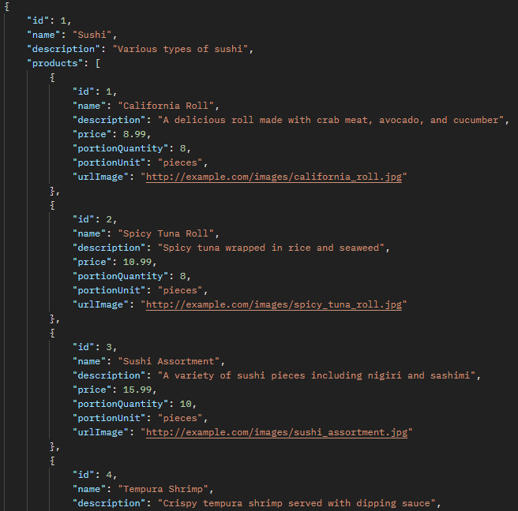
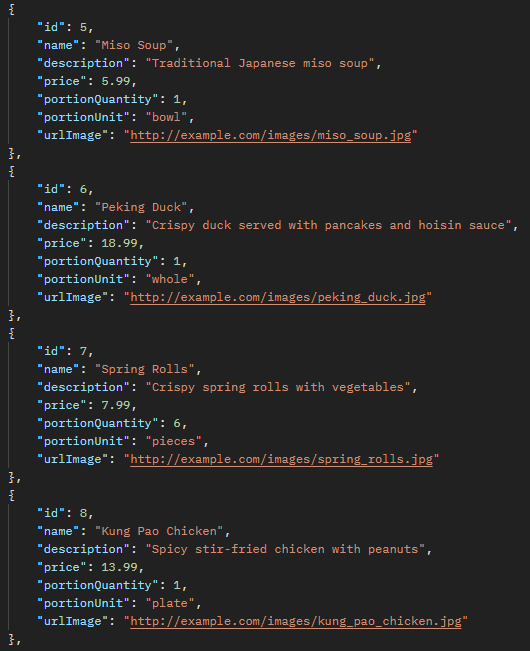
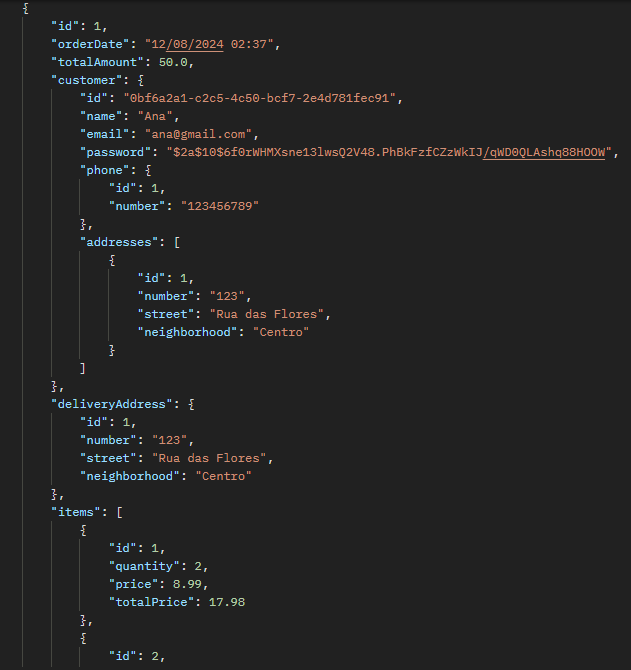
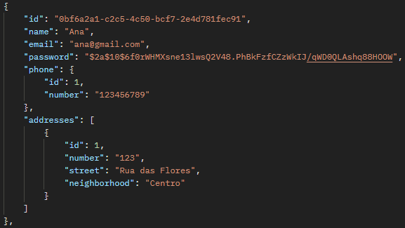
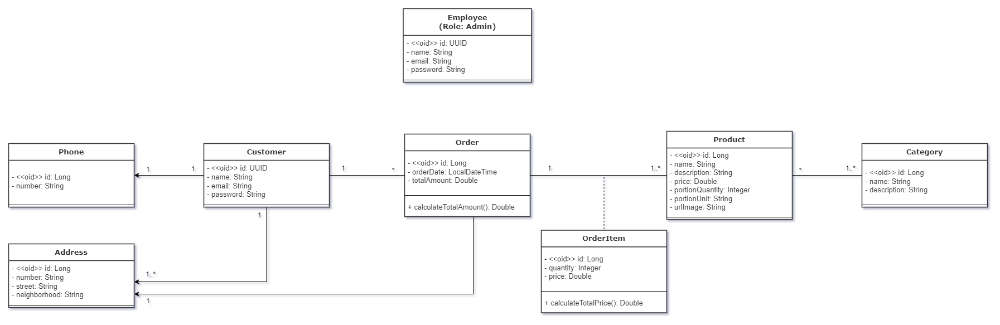
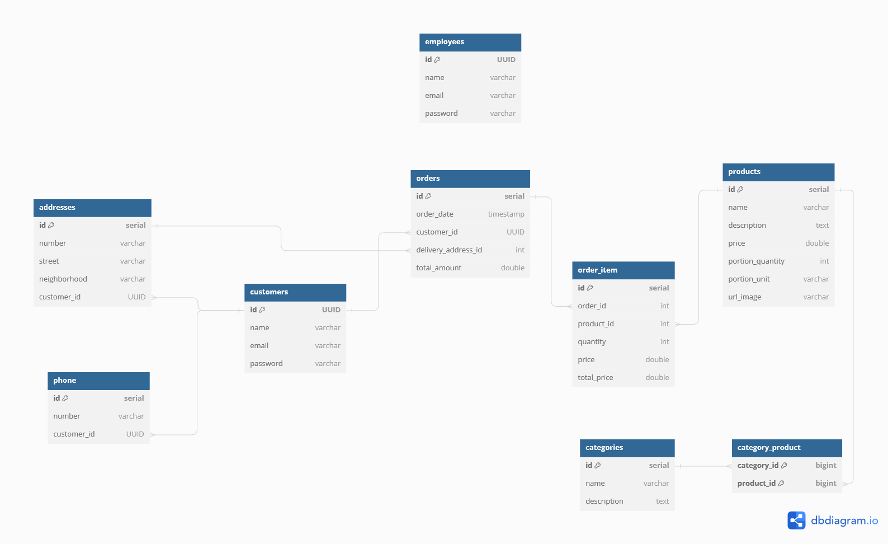

<h1 align="center">
  Sistema de Pedidos de Sushi
</h1>

## Descrição

Esse projeto foi desenvolvido para os clientes realizarem pedidos de sushi online. Com esta API, os clientes visualizam o cardápio, os produtos dentro de cada categoria e realizam os pedidos. 

Para os funcionários, a API oferece ferramentas para gerenciar o cardápio e produtos, processar pedidos e administrar clientes.

    
<b>Categorias</b>

    

    
<b>Produtos</b>

    

    
<b>Pedidos</b>

    

    
<b>Cliente</b>

    

## Tecnologias

- Linguagem: Java
- Framework:
- Banco de Dados: PostgreSQL
- Maven
- Flyway Migrations
- Java JWT
- JUnit
- Mockito
- Spring Validation

## Deploy
A API está hospedada no [Render](https://render.com/) e pode demorar um pouco para carregar.

- **Acessar a Documentação da API no Render**: https://sushi-ordering-system.onrender.com/swagger-ui/index.html
- **Acessar a Documentação da API localmente**: http://localhost:8080/swagger-ui/index.html#/
- **Coleção JSON com as Requisições HTTP (Postman ou Insomnia)**: [Collection](media/sushi_ordering_system_collection.json)

## Diagramas

    
Diagrama de Classes

    

    
Diagrama de Entidade e Relacionamento

    

## Configuração e Execução
Pré-requisito: Java 17 e Maven
1. Clone o repositório
2. Instale as dependências do **pom.xml** com Maven
3. Crie o database no PostgreSQL com as configurações do **application.properties**
4. Execute o **Application.java**

### Autor
Isabel Henrique

https://www.linkedin.com/in/isabel-henrique/
